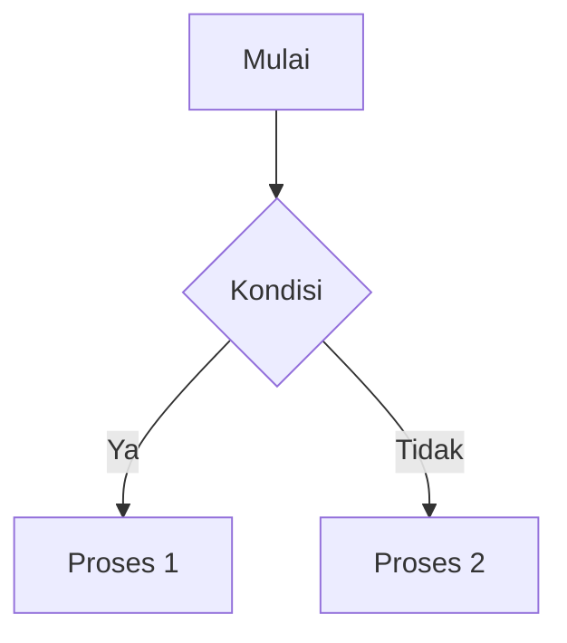

# Santrilogy AI for Blogger

Santrilogy AI adalah template Blogger canggih yang menyediakan antarmuka chat AI untuk diskusi tentang Kitab Kuning, pendidikan Islam, teknologi, dan cerita inspiratif.

## Deskripsi Proyek

Template ini menyediakan:
- Chat interface yang mirip dengan ChatGPT
- Mendukung tampilan teks Arab dan Al-Quran yang indah
- Sistem otentikasi dan history chat
- Fitur diagram dan code highlighting
- Mode gelap dan terang
- Desain responsif untuk mobile dan desktop

## Struktur File

```
js/
├── main.js          # Fungsi utama aplikasi
├── firebase.js      # Fungsi Firebase untuk otentikasi dan database
└── utils.js         # Fungsi utilitas umum
```

## Fitur Utama

1. **Desain Modern** - Menggunakan sistem desain dengan CSS variables
2. **Teks Arab** - Mendukung teks Arab dan Al-Quran dengan format khusus
3. **Diagram** - Dapat menampilkan diagram dengan Mermaid
4. **Kode** - Syntax highlighting untuk berbagai bahasa pemrograman
5. **History** - Menyimpan riwayat percakapan
6. **Otentikasi** - Login dengan email atau Google
7. **Open Graph** - Dukungan untuk sharing media sosial dengan gambar og:image yang telah ditentukan
8. **Arsitektur Aman** - Mendukung integrasi dengan Cloudflare Workers untuk keamanan produksi
9. **Production Ready** - Telah di-deploy di `https://worker-santrilogy-ai.santrilogyapp.workers.dev`

## Format Teks Arab

- Ayat Al-Quran: `[QURAN]الْحَمْدُ لِلَّهِ رَبِّ الْعَالَمِينَ[/QURAN]`
- Teks Arab biasa: `[ARAB]الحَمْدُ لِلَّهِ رَبِّ العَالَمِينَ[/ARAB]`
- Arab dengan terjemahan: `[ARAB-TERJEMAH]اَلسَّلَامُ عَلَيْكُمْ---Salam sejahtera[/ARAB-TERJEMAH]`
- Arab inline: `<<بِسْمِ اللَّهِ>>`

## Format Diagram

Menggunakan Mermaid:
```

```

## Konfigurasi

File `main.js` berisi konfigurasi penting seperti:
- URL worker API
- Konfigurasi sistem prompt AI
- Pengaturan UI

## Instalasi

Sebelum menggunakan template ini di Blogger:

1. Ganti API keys Firebase dengan yang aman
2. Sesuaikan URL worker dengan layanan Anda
3. Sertakan file JS di template Blogger

## Kontribusi

Silakan fork repository ini dan kirimkan pull request jika ingin berkontribusi pada pengembangan template ini.

## Lisensi

[Spesifikasikan lisensi di sini jika ada]

## Catatan Keamanan

- API keys tidak boleh disertakan di kode client-side
- Gunakan Firebase Security Rules yang ketat
- Jangan tampilkan konfigurasi sensitif di kode yang dapat diakses publik